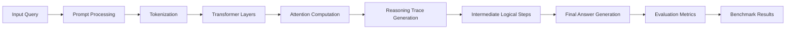
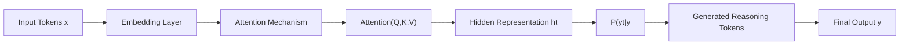
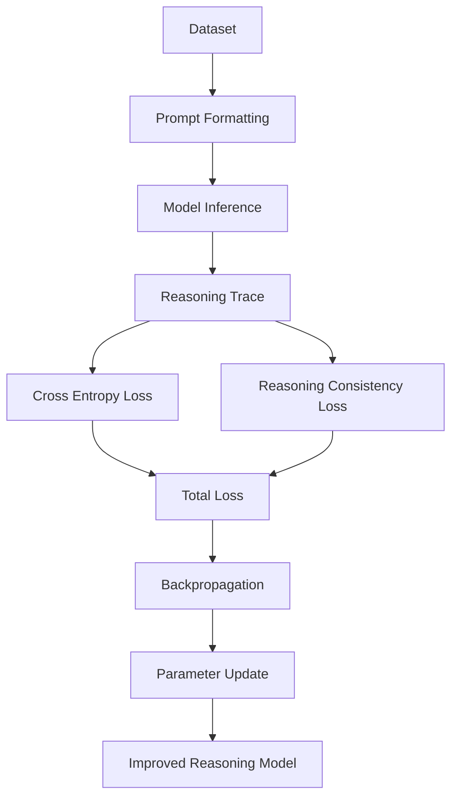
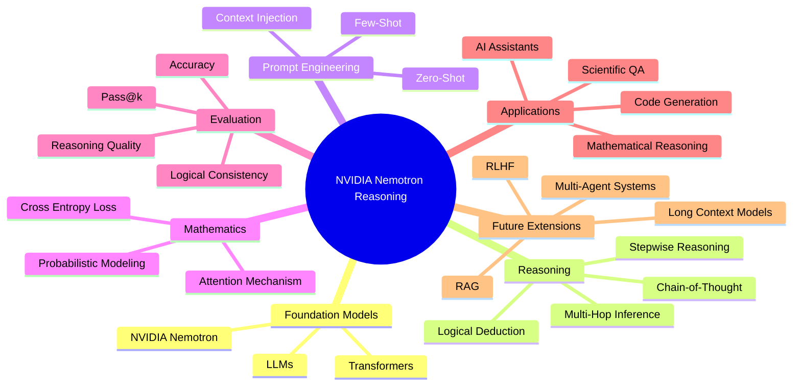

# NVIDIA Nemotron Model Reasoning Challenge

## Overview

This project presents a reasoning-focused large language model (LLM) framework developed for the NVIDIA Nemotron Model Reasoning Challenge. The repository explores advanced reasoning capabilities using NVIDIA Nemotron models, combining structured prompting, chain-of-thought reasoning, evaluation pipelines, and scalable experimentation for complex problem-solving tasks.

The framework integrates transformer-based language models with reasoning-centric methodologies to improve logical consistency, multi-step inference, mathematical reasoning, and contextual understanding across diverse benchmarks.

The project is designed to provide reproducible workflows for inference, evaluation, and reasoning optimization using NVIDIA Nemotron and compatible open-source LLM ecosystems.

---

# Key Objectives

- Develop reasoning-oriented AI systems using NVIDIA Nemotron models
- Improve multi-step logical and mathematical reasoning
- Enhance chain-of-thought and structured inference
- Benchmark reasoning performance across standard datasets
- Improve answer consistency and interpretability
- Enable scalable experimentation workflows
- Support modular reasoning pipelines

---

# System Architecture

```mermaid
graph TD

A[User Prompt] --> B[Prompt Engineering Module]

B --> C[Zero-Shot Prompting]
B --> D[Few-Shot Prompting]
B --> E[Chain-of-Thought Templates]

C --> F[NVIDIA Nemotron Model]
D --> F
E --> F

F --> G[Transformer Architecture]

G --> H[Self Attention]
G --> I[Feed Forward Network]
G --> J[Positional Encoding]

H --> K[Contextual Understanding]
I --> K
J --> K

K --> L[Reasoning Generation]

L --> M[Step-by-Step Reasoning]
L --> N[Logical Deduction]
L --> O[Mathematical Inference]

M --> P[Final Response]
N --> P
O --> P

P --> Q[Evaluation Pipeline]

Q --> R[Accuracy]
Q --> S[Logical Consistency]
Q --> T[Pass@k]
Q --> U[Reasoning Quality]
```

---

# Model Architecture

## Reasoning-Oriented LLM Framework

The framework combines:

- NVIDIA Nemotron foundation models
- Structured prompt engineering
- Chain-of-thought reasoning
- Context-aware inference
- Benchmark evaluation pipelines
- Modular experimentation utilities

The architecture is designed for:

- Mathematical reasoning
- Logical deduction
- Scientific QA
- Code reasoning
- Multi-hop inference
- General-purpose analytical tasks

---

# Workflow Pipeline



---

# Core Components

## 1. Prompt Engineering Module

The prompting framework supports:

- Zero-shot reasoning
- Few-shot prompting
- Step-by-step reasoning templates
- Context injection
- Instruction tuning

The objective is to guide the model toward explicit and interpretable reasoning paths.

---

## 2. Chain-of-Thought Reasoning

The framework explicitly generates intermediate reasoning steps:

```math
P(y|x) = \prod_{t=1}^{T} P(y_t | y_{<t}, x)
```

Where:

- \(x\) represents the input prompt
- \(y_t\) represents generated reasoning tokens
- \(T\) is the sequence length

This enables:

- Multi-step deduction
- Improved transparency
- Reduced hallucinations
- Better logical consistency

---

## 3. Attention-Based Context Modeling

The transformer architecture uses scaled dot-product attention:

```math
Attention(Q,K,V) = softmax\left(\frac{QK^T}{\sqrt{d_k}}\right)V
```

Where:

- \(Q\) = Query matrix
- \(K\) = Key matrix
- \(V\) = Value matrix
- \(d_k\) = Key dimension scaling factor

This mechanism enables long-context reasoning and contextual understanding.

---

# Transformer Mathematical Pipeline



---

## 4. Probabilistic Token Generation

The model predicts the next token probability using:

```math
P(w_t|w_{<t}) = softmax(W_h h_t + b)
```

Where:

- \(h_t\) = hidden transformer representation
- \(W_h\) = learnable projection matrix
- \(b\) = bias term

---

# Mathematical Formulation

## Language Modeling Objective

The training objective minimizes cross-entropy loss:

```math
\mathcal{L}_{CE} = - \sum_{t=1}^{T} \log P(y_t | y_{<t}, x)
```

---

## Reasoning Consistency Objective

Reasoning consistency can be formulated as:

```math
\mathcal{L}_{reason} = ||R_{pred} - R_{target}||_2^2
```

Where:

- \(R_{pred}\) = predicted reasoning trace
- \(R_{target}\) = expected reasoning trace

---

## Total Optimization Objective

```math
\mathcal{L}_{total} = \lambda_1 \mathcal{L}_{CE} + \lambda_2 \mathcal{L}_{reason}
```

Where:

- \(\lambda_1\), \(\lambda_2\) are balancing coefficients

---

# Training and Optimization Pipeline



---

# Evaluation Framework

The repository evaluates:

- Accuracy
- Pass@k
- Logical consistency
- Multi-step reasoning quality
- Context retention
- Response coherence

---

# Benchmark Tasks

Supported benchmark categories include:

- GSM8K
- MATH
- HumanEval
- ARC
- GPQA
- BIG-Bench
- Scientific reasoning datasets
- Logical inference datasets

---

# Benchmarking Mindmap



---

# Applications

The framework can be applied to:

- Mathematical reasoning systems
- Scientific QA pipelines
- AI coding assistants
- Autonomous reasoning agents
- Research automation
- Intelligent tutoring systems

---

# Future Extensions

Potential future extensions include:

- RLHF integration
- Retrieval-Augmented Generation (RAG)
- Multi-agent reasoning systems
- Tool-augmented reasoning
- Long-context optimization
- Hybrid symbolic-neural reasoning

---

# Design Principles

## Reasoning-Centric AI

Focus on:

- Multi-step reasoning
- Explainability
- Structured inference
- Transparent decision-making

---

## Modularity

Clear separation between:

- Prompting
- Inference
- Evaluation
- Experimentation
- Benchmarking

---

## Scalability

The framework supports:

- Large-scale reasoning experiments
- Modular model integration
- Benchmark extensibility
- Future RLHF and RAG integration

---

# Key Takeaways

- Chain-of-thought reasoning improves interpretability
- Structured prompting enhances logical consistency
- Attention mechanisms enable contextual reasoning
- NVIDIA Nemotron models provide strong reasoning performance
- Modular evaluation pipelines improve experimentation efficiency

---

# License

By Anjan Mahapatra.

This project is intended for educational and research purposes.

Refer to applicable licenses for NVIDIA Nemotron models, PyTorch, Hugging Face Transformers, and associated datasets.
